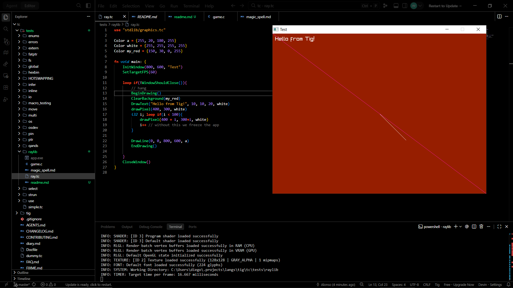

# Raylib in Tig test

This is a test of raylib in Tig. Since Tig transpiles to C like Nim, interop is semi-trivial. 

Compile demo with
```bash
tig ray.tc -o game.c
gcc game.c -o game.exe -Isrc -IC:/raylib/raylib/src -LC:/raylib/raylib/build/raylib  -lraylib -lws2_32 -lwinhttp -lopengl32 -lgdi32 -lwinmm
# you could also do: 
tig ray.tc -c game.exe -- -Isrc -IC:/raylib/raylib/src -LC:/raylib/raylib/build/raylib  -lraylib -lws2_32 -lwinhttp -lopengl32 -lgdi32 -lwinmm # but this method is broken for some reason
```
Run demo with
```bash
./game.exe
```
Next project is pong.


